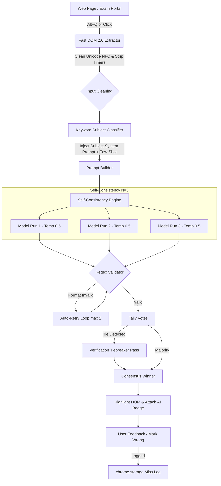

<div align="center">

# ⚡ Anser (አንሰር)
### The High-Accuracy AI Exam Solver & Study Copilot for Ethiopian Curricula
**Manifest V3 Chrome & Edge Extension • Cross-Lingual Reasoning • Multi-Provider AI**

[](https://developer.chrome.com/docs/extensions/mv3/intro/)
[](https://github.com/Kidus-yahun/anser-extension)
[](https://aistudio.google.com/)
[](https://opensource.org/licenses/MIT)

[Features](#-features) • [The Vision](#-the-vision--why-anser) • [How It Works](#-cognitive-pipeline) • [Benchmark](#-benchmark-suite) • [Installation](#-installation) • [Configuration](#-configuration)

</div>

---

## 🌟 The Vision & Why Anser?

Standard LLMs often struggle with Ethiopian high school and national university entrance exams. Why?

1. **The Amharic Token & Reasoning Gap**: While frontier models understand Amharic (Ge'ez script), their internal reasoning and training token density in Amharic are vastly inferior to English. Complex Grade 11–12 Physics, Chemistry, and Calculus problems solved directly in Amharic frequently lead to hallucinations, arithmetic misses, or misinterpretations.
2. **Cultural & Curriculum Nuances**: Ethiopian exams feature specific conventions—such as Ethiopian Calendar years (ዓ.ም vs G.C., which are ~7–8 years apart), Ge'ez multiple-choice labels (ሀ, ለ, ሐ, መ), and curriculum-aligned textbook terminology.
3. **Platform Clutter in Exam Portals**: Modern online test portals wrap questions in complex DOMs, countdown timers (`8 ሰከንዶች ይቀራሉ`), banners (`ጥያቄዎችን በመመለስ ይሸለሙ`), and dynamically rendered SPAs.

**Anser bridges this gap.** It is an intelligent browser extension engineered specifically to conquer Amharic and mixed Amharic/English multiple-choice questions with **near-100% precision**. By executing an internal cross-lingual translation and reasoning protocol, consulting subject-tailored system personas, and voting across parallel runs using self-consistency, Anser elevates exam solving from a hit-or-miss ~70% baseline to **15/15 benchmark mastery**.

---

## 🚀 Features

### 🧠 1. Cross-Lingual "Reason in English" Engine
- **Internal Translation**: Automatically translates the Amharic question and choices into English internally.
- **English Scientific Reasoning**: Solves mathematical derivations, stoichiometric equations, or physics formulas in English where the LLM's analytical weights are strongest.
- **Faithful Index Mapping**: Flawlessly maps the conclusion back to the original option letter (A/B/C/D or ሀ/ለ/ሐ/መ) without altering option order.

### 🗳️ 2. Self-Consistency Majority Voting (N = 3 to 5)
- Rather than relying on a single greedy call, Anser sends the question $N$ times concurrently with temperature $\approx 0.5$.
- Collects and tallies votes across diverse chain-of-thought traces.
- Employs an automated **Verification Pass** to arbitrate and break ties before final selection.

### 📚 3. Subject-Specific Expert Prompts & Few-Shot Learning
- **Dynamic Auto-Detection**: Instant keyword detection identifies the subject from question text (Math, Physics, Chemistry, Biology, English, Aptitude).
- **Curriculum Guidance**:
  - **Physics (ፊዚክስ)**: Enforces formula writing first, numerical substitution, and unit checks.
  - **Chemistry (ኬሚስትሪ)**: Enforces redox balance, stoichiometry, and unit validation.
  - **Biology (ባዮሎጂ)**: Adheres to Ethiopian textbook taxonomy and cellular terminology.
  - **Math (ሂሳብ)**: Mandates step-by-step arithmetic and double-checking.
  - **English**: Strictly applies grammatical tense, subject-verb agreement, and prepositions.
  - **Aptitude (አፕቲቲዩድ)**: Deconstructs numeric sequences, verbal analogies, and abstract logic.
- **Manual Override Dropdown**: Force a specific subject in the popup for targeted practice sessions.
- **Editable `subjects.json`**: Easily add or tune few-shot exemplars.

### 🧼 4. Intelligent Text Sanitization & Fast DOM 2.0
- **Unicode NFC Normalization**: Strips zero-width joiners, invisible characters (`\u200B`, `\uFEFF`, etc.), and control codes that confuse LLM tokenizers.
- **Noise Filter**: Erases countdown timers, point values (`[1.00 pts]`), and quiz slogans before the prompt is constructed.
- **Chakra / React Portal Awareness**: Scrapes directly from `.my-content`, `.chakra-stack`, and option cards in modern web exam apps.
- **Vision Crop Fallback**: When DOM text isn't selectable, takes a high-DPI tight crop of the quiz card for Gemini Multimodal Vision.

### 🔄 5. Strict Output Regex Validation & Auto-Retry
- Every model response is strictly parsed for `ANSWER: X`.
- If a response deviates from the contract, Anser automatically initiates up to **2 retries** with format reminders—preventing UI lockups or silent crashes.

### 📉 6. Continuous Improvement: Miss Log & Export
- Found a question the model missed? Click the small **"Mark Wrong"** button directly on the badge.
- Enter the correct letter to record `{question, options, model_answer, correct_answer, subject, timestamp}` into `chrome.storage.local`.
- Use the **"Export Misses"** button in the popup to download your dataset in JSON format for analysis and few-shot fine-tuning.

### 🔌 7. Universal AI Provider Support
- **Google Gemini**: Full support for `gemini-2.5-flash`, `gemini-3.5-flash-lite`, and native `thinkingConfig` reasoning budgets.
- **Anthropic Claude**: Claude 3.5 Sonnet, Claude 3.5 Haiku.
- **OpenAI**: GPT-4o, GPT-4o-mini.
- **Groq & OpenRouter**: Ultra-fast inference with Llama 3 / Mixtral.
- **Custom Local Endpoints**: Connect to Ollama, LM Studio, or vLLM via OpenAI-compatible endpoints.

### 🥷 8. Stealth Mode & Speed Controls
- Global shortcut: <kbd>Alt</kbd> + <kbd>Q</kbd> to solve instantly.
- Toggle between **Highlight Only** or **Auto-Click**.
- Enable **Stealth Mode** to hide on-screen buttons and operate purely via keyboard shortcuts.

---

## 🧩 Cognitive Pipeline



---

## 📊 Benchmark Suite

The repository includes [`test.html`](test.html)—an interactive testing ground featuring **15 past exam questions** representative of the Ethiopian National Secondary Exam (Natural Science stream):

| Subject | Topic / Concept Tested | Language Format | Ground Truth |
| :--- | :--- | :--- | :---: |
| **Physics** | Kinematics: Acceleration calculation ($a = \frac{v-u}{t}$) | Amharic | **B (5 m/s²)** |
| **Physics** | Vector vs. Scalar identification (Work is scalar) | Amharic | **C (ስራ / Work)** |
| **Chemistry** | Strong acid $\text{pH}$ calculation ($0.001\text{ M HCl}$) | Mixed Amharic/Eng | **C (3)** |
| **Chemistry** | Oxidation state of Sulfur in $\text{H}_2\text{SO}_4$ | Mixed Amharic/Eng | **C (+6)** |
| **Biology** | Powerhouse of the cell (Mitochondria / ATP) | Amharic | **C (ሚቶኮንድሪያ)** |
| **Biology** | Watson-Crick DNA base pairing (Adenine-Thymine) | Amharic | **A (ታይሚን)** |
| **Math** | Linear algebraic equation ($3x - 7 = 14$) | Amharic | **B (7)** |
| **Math** | Logarithm calculation ($\log_{10} 10{,}000$) | Mixed Amharic/Eng | **B (4)** |
| **English** | Subject-verb agreement with *"Neither... nor..."* | English | **C (were)** |
| **English** | Preposition of time duration (*"since 2010"*) | English | **B (since)** |
| **Aptitude** | Geometric multiplication sequence ($2, 6, 18, 54, \dots$) | Amharic | **B (162)** |
| **Aptitude** | Verbal analogy (*Day is to Light as Night is to...*) | Amharic | **A (ጨለማ)** |
| **Biology** | Pancreatic islets & insulin secretion | Amharic | **B (ቆሽት)** |
| **Physics** | Ohm's law: Electrical resistance ($R = \frac{V}{I}$) | Amharic | **B (40 Ω)** |
| **Math** | $2 \times 2$ Matrix determinant ($ad - bc$) | Amharic | **A (2)** |

### Running the Benchmark
1. In Chrome, open `chrome://extensions`.
2. Ensure **"Allow access to file URLs"** is enabled in the Anser details.
3. Open [`test.html`](test.html) in your browser.
4. Press <kbd>Alt</kbd> + <kbd>Q</kbd> on each question to observe the live scoring widget update automatically toward **15/15**.

---

## 🛠️ Installation

1. **Clone the repository**:
   ```bash
   git clone https://github.com/Kidus-yahun/anser-extension.git
   ```

2. **Load into Chrome or Edge**:
   - Navigate to `chrome://extensions` (or `edge://extensions`).
   - Enable **Developer mode** (toggle in the top-right corner).
   - Click **Load unpacked** and select the `anser-extension` folder.

3. **Configure your API Key**:
   - Click the **Anser** puzzle icon in your browser toolbar.
   - Select your provider (**Google Gemini**, **OpenAI**, **Anthropic**, etc.).
   - Paste your API key (get a free Gemini key at [Google AI Studio](https://aistudio.google.com/app/apikey)).
   - Click **Connect** & **Save Preferences**.

---

## ⚙️ Configuration

Customization settings can be modified via the popup UI or directly in the configuration files:

### `config.json`
```json
{
  "consensusN": 3,
  "maxConsensusN": 5,
  "consensusTemperature": 0.5,
  "thinkingBudget": 2048,
  "maxRetries": 2,
  "rateLimitBackoffMs": 1000,
  "concurrencyLimit": 3
}
```

### `subjects.json`
Define keywords, customized pedagogical instructions, and few-shot examples for each subject stream:
```json
{
  "Physics": {
    "keywords": ["ፊዚክስ", "ኃይል", "ፍጥነት", "force", "velocity", "acceleration"],
    "systemPrompt": "Expert Ethiopian Grade 9-12 Physics teacher. Write the formula first, substitute values, include units in every step.",
    "fewShot": [ ... ]
  }
}
```

---

## 🗺️ Roadmap

- [x] Manifest V3 Migration with Background Service Worker
- [x] Multi-Provider Support (Gemini, Claude, GPT-4o, Groq, Ollama)
- [x] Cross-Lingual English Reasoning Protocol
- [x] N-Call Self-Consistency Majority Voting & Tie-Breaker
- [x] Subject Auto-Detection & Ethiopian Curriculum System Prompts
- [x] Real-time Miss Logging & JSON Export
- [x] Full 15-Question Ethiopian Exam Benchmark Suite
- [ ] Offline local model integration (WebGPU / Transformers.js)
- [ ] Automated bulk test-solving for practice exam simulation
- [ ] PDF exam paper auto-slicing and solver

---

## 🤝 Contributing

Contributions to expand few-shot question banks, refine Amharic NLP prompts, or enhance portal DOM scrapers are welcome! Feel free to open an issue or submit a pull request.

---

<div align="center">
  <b>Built with ❤️ for Ethiopian Students and Educators</b>
</div>
